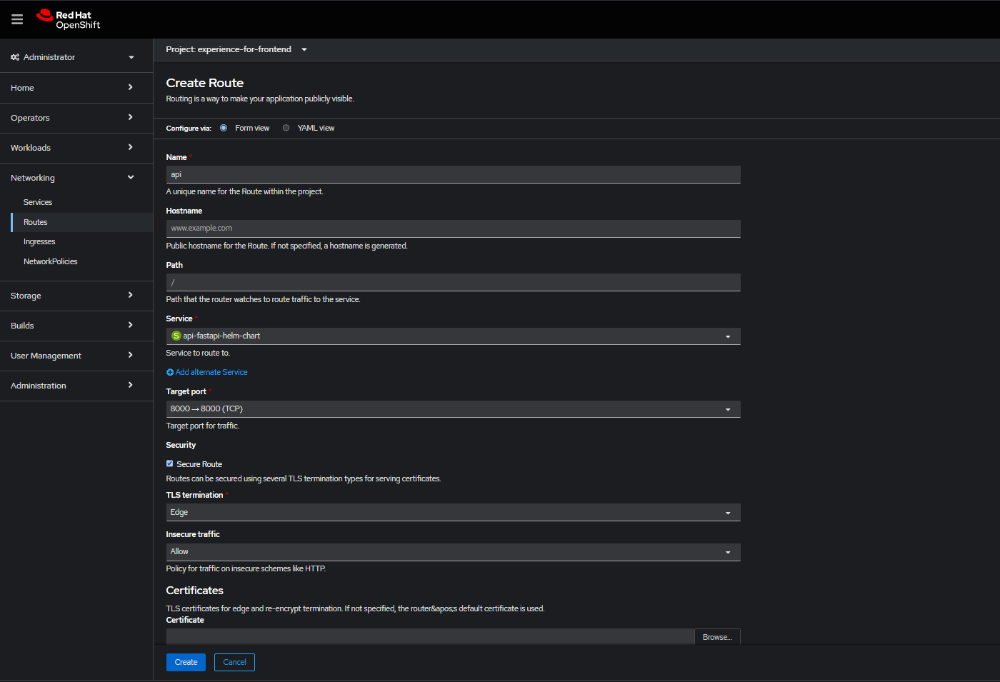

<p align="center">
  
</p>

[](https://helm.sh)
[](https://www.openshift.com)
[](https://fastapi.tiangolo.com)
[](https://www.docker.com)
[](LICENSE)

# FastAPI Helm Chart

This is a Helm chart for a FastAPI application. This chart is designed to deploy FastAPI applications on OpenShift clusters with customizable configurations.

## Prerequisites

- Helm CLI (version 3+)
- OpenShift Cluster (version 4.x recommended)
- Docker (for building application images)
- Poetry (for Python dependency management)


## Configuration

The following tables describe the configurable parameters of the FastAPI Helm chart. You can override these values by creating your own values.yaml file.

### Core Configuration
| Parameter | Description | Default |
|-----------|-------------|---------|
| `replicaCount` | Number of replicas of the FastAPI application | `1` |

### Image Configuration
| Parameter | Description | Default |
|-----------|-------------|---------|
| `image.registry` | Docker registry for the FastAPI image | `""` |
| `image.repository` | Docker image repository | `""` |
| `image.tag` | Docker image tag | `""` |
| `image.pullPolicy` | Image pull policy (Always, IfNotPresent, Never) | `IfNotPresent` |
| `imagePullSecrets` | Image pull secrets for private registries | `[]` |

### Network Configuration
| Parameter | Description | Default |
|-----------|-------------|---------|
| `service.type` | Kubernetes service type (ClusterIP, LoadBalancer, NodePort) | `ClusterIP` |
| `service.port` | Service port for accessing the application | `80` |

### Environment Variables (ConfigMap)
You can define as many environment variables as needed in the configMap. The chart comes with some default FastAPI application environment variables. These variables will be available to your FastAPI application at runtime.

| Parameter | Description | Default |
|-----------|-------------|---------|
| `configMap.data.APP_NAME` | Name of the FastAPI application | `"Example FastAPI App"` |
| `configMap.data.DEBUG` | Enable debug mode (true/false) | `false` |
| `configMap.data.VERSION` | Application version | `"0.1.0"` |

To add or modify environment variables, you can update the `configMap.data` section in your values.yaml file. For example:

```yaml
configMap:
  data:
    APP_NAME: "My FastAPI Application"
    DEBUG: "false"
    VERSION: "1.0.0"
    CUSTOM_VAR: "custom-value"  # Add your custom variables here
```

### OpenShift Route Configuration
| Parameter | Description | Default |
|-----------|-------------|---------|
| `route.enabled` | Enable OpenShift route for external access | `false` |
| `route.host` | Route hostname (e.g., myapp.apps.cluster.com) | `""` |
| `route.path` | Route path | `/` |
| `route.tls.enabled` | Enable TLS for secure routes | `false` |
| `route.tls.termination` | TLS termination type (edge, passthrough, reencrypt) | `edge` |
| `route.tls.insecureEdgeTerminationPolicy` | How to handle insecure traffic | `Allow` |

### Resource Management
| Parameter | Description | Default |
|-----------|-------------|---------|
| `resources.limits.cpu` | Maximum CPU allocation | `""` |
| `resources.limits.memory` | Maximum memory allocation | `""` |
| `resources.requests.cpu` | Minimum CPU requirement | `""` |
| `resources.requests.memory` | Minimum memory requirement | `""` |

### Scheduling Configuration
| Parameter | Description | Default |
|-----------|-------------|---------|
| `nodeSelector` | Node labels for pod assignment | `{}` |
| `tolerations` | Pod tolerations for node taints | `[]` |
| `affinity` | Pod affinity/anti-affinity rules | `{}` |


## Build the Docker image

### Build
```bash
docker build -t {YOUR_DOCKER_REGISTRY}/{YOUR_DOCKER_IMAGE_NAME}:{YOUR_DOCKER_TAG} .
```


### Tag
```bash
docker tag {YOUR_DOCKER_IMAGE_NAME}:{YOUR_DOCKER_TAG} {YOUR_DOCKER_REGISTRY}/{YOUR_DOCKER_IMAGE_NAME}:{YOUR_DOCKER_TAG}
```


### Push
```bash
docker push {YOUR_DOCKER_REGISTRY}/{YOUR_DOCKER_IMAGE_NAME}:{YOUR_DOCKER_TAG}
```


## Example of Implemented Values.yaml file

```yaml
# Number of application replicas to run
replicaCount: 1

# Container image configuration
image:
  repository: {YOUR_DOCKER_REGISTRY}  # e.g., quay.io/myorg/myapp
  tag: {YOUR_DOCKER_TAG}  # e.g., latest, v1.0.0
  pullPolicy: {YOUR_DOCKER_PULL_POLICY}  # Usually IfNotPresent or Always

# Secrets for pulling images from private registries
imagePullSecrets:
  - name: {YOUR_IMAGE_PULL_SECRET_NAME}

# Optional name overrides
nameOverride: ""
fullnameOverride: ""

# Service configuration for accessing your application
service:
  type: LoadBalancer  # Can be ClusterIP, LoadBalancer, or NodePort
  port: 80  # Port your service will listen on

# Environment variables for your application
configMap:
  data:
    APP_NAME: {YOUR_APP_NAME}  # e.g., "My FastAPI App"
    DEBUG: {YOUR_DEBUG_VALUE}  # e.g., "false"
    VERSION: {YOUR_VERSION}  # e.g., "1.0.0"
    # Add your custom environment variables here

# OpenShift Route configuration
route:
  enabled: false  # Set to true to create a Route
  host: ""  # Your route hostname
  path: /
  tls:
    enabled: false
    termination: edge
    insecureEdgeTerminationPolicy: Allow

# Resource limits and requests
resources:
  limits:
    cpu: 100m  # 100 millicores = 0.1 CPU
    memory: 128Mi  # 128 megabytes
  requests:
    cpu: 100m
    memory: 128Mi

# Pod scheduling configurations
nodeSelector: {}  # Add node selectors if needed

tolerations: []  # Add tolerations if needed

affinity: {}  # Add affinity rules if needed
```

## Installation

To install the chart with the release name "fastapi-chart":

#### Clone the repository

```bash
git clone https://github.com/anqorithm/fastapi-helm-chart.git
```


#### Install the chart

```bash
helm install fastapi-chart ./charts/fastapi
```


#### Open OpenShift to see the application


#### Create a route to access the application




#### Access the application


This will deploy your FastAPI application to the OpenShift cluster using the default configuration values. For custom configurations, create a values.yaml file with your desired settings and use:

```bash
helm install fastapi-chart ./charts/fastapi -f values.yaml
```
