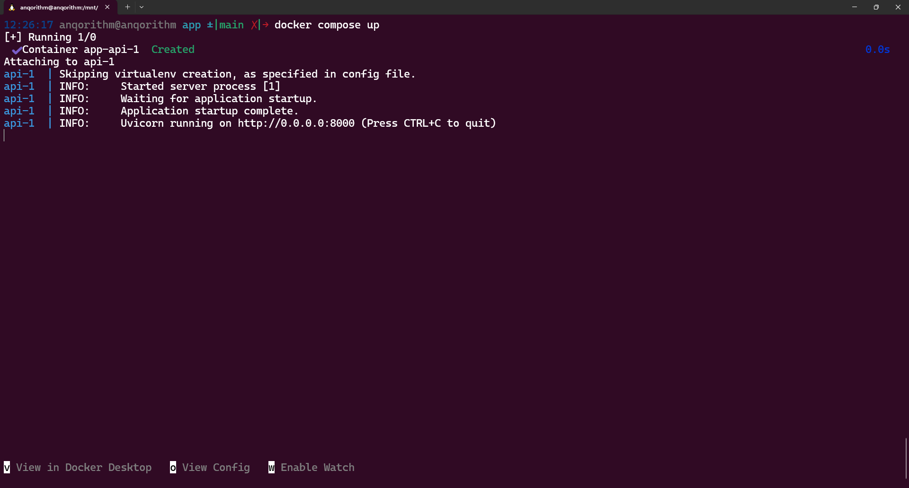

# FastAPI Helm Chart Example

This is a very simple FastAPI example application, to be used as in the [FastAPI Helm Chart](https://github.com/anqorithm/fastapi-helm-chart).

## TL;DR

```bash
docker compose up --build
```



## Configuration

The following table describes the configurable parameters of the FastAPI Helm chart:

| Parameter | Description | Default |
|-----------|-------------|---------|
| `name` | The name of the FastAPI application | `fastapi` |
| `debug` | Whether to run the application in debug mode | `false` |
| `version` | The version of the FastAPI application | `0.1.0` |

## Contributors

- [Abdullah Alqahtani](https://github.com/anqorithm)
